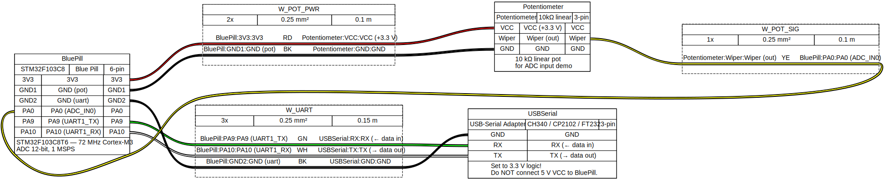

[](https://classroom.github.com/a/XWhQbpl8)
# DM2 — Práctica 2: Señales Físicas

**ADC · Ruido · Filtrado · Telemetría**

Diseño Mecatrónico II · IOR444 · Universidad de San Andrés — 2026

---

## Objetivos

Al finalizar esta práctica vas a poder:

1. Conectar y leer un potenciómetro via ADC con HAL
2. Enviar muestras a la PC via UART y visualizarlas en tiempo real
3. Cuantificar el ruido eléctrico de una señal analógica (varianza)
4. Comparar el efecto del filtro RC vs. oversampling por software
5. Empaquetar la lectura ADC en una interfaz limpia (`adc_read_filtered()`)
6. Agregar diagnóstico de saturación y reporte periódico

---

## Hardware necesario

| Ítem | Cantidad |
|------|----------|
| STM32F103C8T6 (Blue Pill) | 1 |
| ST-Link v2 + cables | 1 |
| Cable USB-A → micro-USB | 1 |
| Conversor USB-Serie (CP2102 / CH340) | 1 |
| Potenciómetro 10 kΩ lineal | 1 |
| Resistencias: 1 kΩ × 2, 100 kΩ × 2, 10 kΩ × 1 | surtido |
| Capacitor 33 nF (filtro RC) | 1 |
| Breadboard + cables Dupont | - |
| Multímetro | 1 |

### Conexiones



> Regenerar: `wireviz tools/stm32_bluepill_lab.yml`

---

## Toolchain

| Herramienta | Versión mínima | Instalar |
|-------------|---------------|---------|
| PlatformIO CLI o VS Code + extensión | 6.x | [platformio.io](https://platformio.org) |
| arm-none-eabi-gcc | 10.x | incluido en PlatformIO |
| Python 3 | 3.8+ | para `tools/plot_serial.py` |
| pyserial + matplotlib | — | `pip install pyserial matplotlib` |

```bash
# Compilar
pio run  #~/miniconda3/bin/pio run

# Compilar + flashear
pio run --target upload

# Monitor serie
pio device monitor --baud 115200
```

---

## Estructura del proyecto

```
dm2-s02/
├── platformio.ini              ← configuración del proyecto
├── src/
│   ├── main.c                  ← boilerplate + TODOs (Acts. 4, 5, 11)
│   ├── adc.h                   ← interfaz pública del módulo ADC
│   └── adc.c                   ← implementación ADC — TODOs (Acts. 8–11)
└── tools/
    ├── plot_serial.py           ← visualizador serie en tiempo real (Python)
    ├── stm32_bluepill_lab.yml   ← fuente WireViz: conexiones MCU↔pot↔UART
    ├── stm32_bluepill_lab.svg   ← diagrama de conexiones (generado)
    └── schemdraw/
        ├── rc_lpf_adc.py        ← fuente: filtro RC solo
        ├── rc_lpf_adc.svg       ← diagrama filtro RC (generado)
        ├── voltage_divider_adc.py  ← fuente: divisor + filtro RC completo
        └── voltage_divider_adc.svg ← diagrama completo (generado)
```

---

## Plan de actividades

| Fase | Actividades | Tiempo |
|:-----|:------------|-------:|
| Setup | Act. 1–2: Potenciómetro · Configurar ADC | ≈ 15 min |
| Observabilidad | Act. 3–4: UART · Stream de muestras | ≈ 15 min |
| Medir ruido | Act. 5–6: Varianza · Divisores resistivos | ≈ 20 min |
| Mejorar señal | Act. 7–8: Filtro RC · Oversampling | ≈ 20 min |
| Empaquetar | Act. 9–11: Función · Clamp · Diagnóstico | ≈ 15 min |
| Documentar | Act. 12–13: V/LSB · Checklist | ≈ 5 min |
| ★ Lab abierto | Act. 14–16: Latencia · Vref · Sampling Time | fuera de clase |

---

## Act. 1 — Verificar el potenciómetro con multímetro

Antes de conectar al MCU, medir con el multímetro en modo VDC:

| Punto | Valor esperado | Valor medido |
|-------|---------------|-------------|
| Extremo A (3V3) | ≈ 3.3 V | 3.318 V |
| Extremo B (GND) | ≈ 0 V | 0 V |
| Cursor al centro | ≈ 1.65 V | 1.671 V |
> **Límite del pin ADC:** máximo **3.3 V**. No conectar 5 V sin divisor de protección.

---

## Act. 2 — ADC configurado (código provisto)

El ADC está configurado en `main.c` con:

- Canal: ADC1_IN0 (PA0)
- Resolución: 12-bit (0–4095)
- Trigger: software
- Sampling time: **28.5 ciclos** @ 4 MHz ADC clock = 7.1 μs
  - Adecuado para Rs ≤ 5 kΩ (potenciómetro al cursor)

---

## Act. 3 — Verificar UART

Abrir un terminal serie a 115200 baud. Debe aparecer `hello` al resetear.

```bash
# Linux / Mac
screen /dev/ttyUSB0 115200

# o con minicom
minicom -D /dev/ttyUSB0 -b 115200

# Windows: PuTTY → Serial → COMx → 115200
```

**Sin UART funcionando, las actividades 4–11 son ciegas. Resolver esto primero.**

---

## Act. 4 — Stream de muestras (TODO en main.c)

Implementar `stream_adc()` en `src/main.c`. Ver las instrucciones en el comentario `TODO`.

Visualizar en Python:
```bash
python3 tools/plot_serial.py /dev/ttyUSB0 115200
```

---

## Act. 5 — Medir ruido (TODO en main.c)

Implementar `medir_ruido()` en `src/main.c`. Anotar aquí los resultados:

| Escenario | Varianza (LSB²) |
|-----------|:--------------:|
| Pot fijo, cable corto | 4.7 |
| Pot fijo, mano en el cable | 6.8 |
| Mano en GND + cable | 3.7 |

¿Por qué tocar GND con la mano reduce el ruido?

`respuesta:` Porque al tocar GND con la mano estamos aumentando la resistencia del GND. Eso genera que el ruido se disipe a traves de la mano, bajando la varianza.

---

## Act. 6 — Divisores resistivos

Reemplazar el pot por dos divisores fijos y medir varianza con `medir_ruido()`:

```
Divisor A (bajo ruido, alto consumo):       Divisor B (bajo consumo, más ruido):
  3V3 ──[1kΩ]──┬──── PA0                     3V3 ──[100kΩ]──┬──── PA0
                │                                              │
             [1kΩ]                                         [100kΩ]
                │                                              │
               GND   V_out=1.65V, I=1.65mA                   GND   V_out=1.65V, I=16.5μA
```

| Divisor | Varianza (LSB²) |
|---------|:--------------:|
| A (2 kΩ total) | 1.9 |
| B (200 kΩ total) | 1.0 |

¿Le alcanza el sampling time de 28.5 ciclos al divisor B?
Rs = 100 kΩ → t_min = 9 × (100 kΩ × 4 pF) = 3.6 μs

---

## Act. 7 — Filtro RC

Agregar un filtro RC entre el divisor A y PA0:


> Regenerar: `python3 tools/schemdraw/voltage_divider_adc.py`

**Solo el filtro RC** (sin divisor — referencia para Act. 8):


> `f_c = 1/(2π × 10kΩ × 33nF) ≈ 482 Hz`

| Condición | Varianza (LSB²) |
|-----------|:--------------:|
| Sin filtro (Act. 5) | 4.7 |
| Con filtro RC | 0.2 |
| Reducción | 96 % |

---

## Act. 8 — Oversampling ×16 (TODO en adc.c)

Implementar `adc_oversample_16()` en `src/adc.c`. Ver el comentario `TODO`.

| Método | Varianza (LSB²) | Costo CPU |
|--------|:--------------:|:---------:|
| Sin filtro | 4.7 | 1× |
| Con RC | 0.2 | 1× |
| Oversample ×16 | 0.2 | 16× |
| RC + oversample | 0.8 | 16× |

Mejora teórica: var / 16. ¿Lo confirman los datos? -> Si

---

## Act. 9–10 — `adc_read_filtered()` con clamp (TODO en adc.c)

Implementar `adc_read_filtered()` en `src/adc.c`.

Verificar:
- [x] Compila sin warnings
- [x] Retorna valores estables con el pot fijo
- [x] `adc_to_volts()` retorna ≈ 1.65 V al centro del pot
- [x] Girar pot al mínimo → ver `WARN: ADC_SAT_MIN` en UART
- [x] Girar pot al máximo → ver `WARN: ADC_SAT_MAX` en UART
- [x] El warning no se repite en spam continuo

---

## Act. 11 — Diagnóstico (TODO en adc.c + main.c)

Implementar `diag_update()` y `diag_report_if_due()` en `src/adc.c`,
y habilitar el loop principal en `src/main.c`.

Salida esperada (una línea cada ~1 segundo):
```
DIAG min=2040 max=2058 n=312
```

Verificar:
- [x] Imprime cada ~1 segundo
- [x] `min` y `max` coherentes con el pot fijo
- [x] `n` ≈ 200–400 muestras/segundo

---

## Act. 12 — Documentar en este README

### ADC Config

- Resolución: 12 bits
- Vref: 3.3 V (VDD)
- Sampling time: 28.5 ciclos @ 4 MHz ADC clock
- 1 LSB = 3300 mV / 4096 = **0.806 mV/LSB**

### Ruido medido

| Método | Varianza (LSB²) | ±mV pp |
|--------|:--------------:|:------:|
| Sin filtro | 4.7 | 3.8 |
| Con filtro RC (f_c = 482 Hz) | 0.2 | 0.2 |
| Oversampling ×16 | 0.2 | 0.2 |

Rango real del pot: `0` a `4095` (cuentas ADC raw)

---

## Act. 13 — Checklist de seguridad eléctrica

- [x] Voltaje máximo del pin ADC: **3.3 V** — la fuente puede excederlo? `No, porque está conectado a 3.3V`
- [x] Si hay señales > 3.3 V: hay divisor de protección?
- [x] Rs de la fuente ≤ 50 kΩ con sampling time de 28.5 ciclos (@ 4 MHz)
- [x] Vref desacoplada con 100 nF cerca del pin VDD
- [x] No hay `printf` ni UART dentro de una ISR

---

## ★ Act. 14–16 — Lab abierto (fuera de clase)

Completar en el repositorio personal antes del gate:

- **Act. 14**: Medir latencia de conversión ADC con osciloscopio (toggle de PA1)
- **Act. 15**: Ensayar falla de Vref: comparar varianza con fuente limpia vs. USB ruidoso
- **Act. 16**: Efecto del sampling time con divisor B (100 kΩ): medir sesgo sistemático

---

## Gate de la sesión — evidencia requerida

- [x] Plot: ≥ 1000 muestras del pot, varianza estabilizada

- [x] Tabla de varianzas: sin filtro vs. RC vs. oversampling
| Método | Varianza (LSB²) | ±mV pp |
|--------|:--------------:|:------:|
| Sin filtro | 4.7 | 3.8 |
| Con filtro RC (f_c = 482 Hz) | 0.2 | 0.2 |
| Oversampling ×16 | 0.2 | 0.2 |

- [x] README con V/LSB, rango real del pot, varianzas completadas
- [x] Código: `adc_read_filtered()` + clamp + diagnóstico funcionando
- [x] Commits: `feat(s02): adc_read_filtered` + `meas(s02): var_sin_filtro=XX` pusheados

### Convención de commits

```
feat(s02): descripción de nueva funcionalidad
fix(s02): corrección de bug
meas(s02): medición o dato experimental
docs(s02): documentación
```

---

## Referencias

- [RM0008 — STM32F103 Reference Manual](https://www.st.com/resource/en/reference_manual/rm0008-stm32f101xx-stm32f102xx-stm32f103xx-stm32f105xx-and-stm32f107xx-advanced-armbased-32bit-mcus-stmicroelectronics.pdf) — ADC (cap. 11), USART (cap. 27)
- [STM32F103C8 Datasheet](https://www.st.com/resource/en/datasheet/stm32f103c8.pdf) — Pinout, características eléctricas
- [AN2834 — How to get the best ADC accuracy in STM32](https://www.st.com/resource/en/application_note/an2834-how-to-get-the-best-adc-accuracy-in-stm32microcontrollers-stmicroelectronics.pdf)
- [PlatformIO — STM32 Blue Pill](https://docs.platformio.org/en/latest/boards/ststm32/bluepill_f103c8.html)

---

*DM2 · IOR444 · Universidad de San Andrés · 2026*
